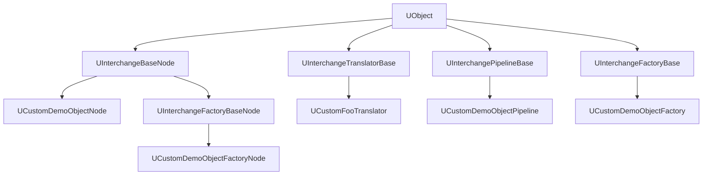

# Unreal Engine 5.5 Interchange 核心API深度分析

## 1. 核心基类层次结构

### 1.1 类继承关系图


## 2. UInterchangeTranslatorBase API

### 2.1 核心虚函数接口
```cpp
class INTERCHANGECORE_API UInterchangeTranslatorBase : public UObject
{
public:
    // 必须重写的核心方法
    virtual TArray<FString> GetSupportedFormats() const PURE_VIRTUAL(UInterchangeTranslatorBase::GetSupportedFormats, return {};);
    virtual bool Translate(UInterchangeBaseNodeContainer& BaseNodeContainer) const PURE_VIRTUAL(UInterchangeTranslatorBase::Translate, return false;);
    
    // 可选重写的方法
    virtual EInterchangeTranslatorAssetType GetSupportedAssetTypes() const { return EInterchangeTranslatorAssetType::None; }
    virtual bool CanImportSourceData(const UInterchangeSourceData* InSourceData) const;
    virtual void ImportFinish();
    
    // 源数据访问
    UPROPERTY()
    TObjectPtr<const UInterchangeSourceData> SourceData;
};
```

### 2.2 自定义翻译器实现模式
```cpp
// 示例：自定义FOO格式翻译器
UCLASS(BlueprintType)
class CUSTOMIMPORT_API UCustomFooTranslator : public UInterchangeTranslatorBase, 
                                             public ICustomDemoObjectPayloadInterface
{
    GENERATED_BODY()
public:
    // 1. 声明支持的文件格式
    virtual TArray<FString> GetSupportedFormats() const override
    {
        TArray<FString> Formats;
        if (GInterchangeEnableCustomFooImport || GIsAutomationTesting)
        {
            Formats.Add(TEXT("foo;FOO my game format"));
        }
        return Formats;
    }
    
    // 2. 设置支持的资产类型
    virtual EInterchangeTranslatorAssetType GetSupportedAssetTypes() const override 
    { 
        return EInterchangeTranslatorAssetType::None; 
    }
    
    // 3. 核心翻译逻辑
    virtual bool Translate(UInterchangeBaseNodeContainer& BaseNodeContainer) const override;
    
    // 4. 载荷数据接口实现
    virtual TOptional<UE::Interchange::FCustomDemoObjectData> GetDemoObjectPayloadData(const FString& PayloadKey) const override;
};
```

## 3. UInterchangeBaseNode API

### 3.1 节点基础接口
```cpp
class INTERCHANGECORE_API UInterchangeBaseNode : public UObject
{
public:
    // 节点初始化
    virtual void InitializeNode(const FString& UniqueID, const FString& DisplayLabel, const EInterchangeNodeContainerType NodeContainerType);
    
    // 节点标识
    virtual FString GetUniqueID() const;
    virtual FString GetDisplayLabel() const;
    virtual void SetDisplayLabel(const FString& DisplayLabel);
    
    // 节点类型
    virtual EInterchangeNodeContainerType GetNodeContainerType() const;
    virtual FString GetTypeName() const PURE_VIRTUAL(UInterchangeBaseNode::GetTypeName, return FString(););
    
    // 属性管理
    template<typename T>
    bool SetAttribute(const UE::Interchange::FAttributeKey& NodeAttributeKey, const T& Value);
    
    template<typename T>
    bool GetAttribute(const UE::Interchange::FAttributeKey& NodeAttributeKey, T& OutValue) const;
    
    // 节点关系
    virtual void AddTargetNodeUid(const FString& TargetNodeUid);
    virtual void RemoveTargetNodeUid(const FString& TargetNodeUid);
    virtual void GetTargetNodeUids(TArray<FString>& OutTargetNodeUids) const;
};
```

### 3.2 自定义节点实现
```cpp
UCLASS(BlueprintType)
class CUSTOMNODES_API UCustomDemoObjectNode : public UInterchangeBaseNode
{
    GENERATED_BODY()
    
public:
    // 专用初始化方法
    UFUNCTION(BlueprintCallable, Category = "Interchange | Node | DemoObject")
    void InitializeCustomDemoObjectNode(const FString& UniqueID, const FString& DisplayLabel);
    
    // 类型名称
    virtual FString GetTypeName() const override { return TEXT("CustomDemoObjectNode"); }
    
    // 载荷键管理
    virtual const TOptional<FString> GetPayLoadKey() const;
    
    UFUNCTION(BlueprintCallable, Category = "Interchange | Node | DemoObject")
    virtual void SetPayLoadKey(const FString& PayLoadKey);
};
```

## 4. UInterchangePipelineBase API

### 4.1 管道基础接口
```cpp
class INTERCHANGEENGINE_API UInterchangePipelineBase : public UObject
{
public:
    // 核心执行方法
    virtual void ExecutePipeline(UInterchangeBaseNodeContainer* InBaseNodeContainer, 
                                const TArray<UInterchangeSourceData*>& InSourceDatas, 
                                const FString& ContentBasePath) {}
    
    // 后处理管道
    virtual void ExecutePostFactoryPipeline(const UInterchangeBaseNodeContainer* InBaseNodeContainer, 
                                           const FString& NodeKey, 
                                           UObject* CreatedAsset, 
                                           bool bIsAReimport) {}
    
    // 编辑器支持
#if WITH_EDITOR
    virtual void FilterPropertiesFromTranslatedData(UInterchangeBaseNodeContainer* InBaseNodeContainer) {}
    virtual void PreDialogCleanup(const FName PipelineStackName) {}
    virtual bool IsSettingsAreValid(TOptional<FText>& OutInvalidReason) const { return true; }
#endif
    
    // 管道配置
    virtual void AdjustSettingsForContext(EInterchangePipelineContext ImportType, TObjectPtr<UObject> ReimportAsset) {}
    virtual void LoadSettings(const FName PipelineStackName) {}
    virtual void SaveSettings(const FName PipelineStackName) {}
};
```

### 4.2 自定义管道实现
```cpp
UCLASS(BlueprintType, editinlinenew)
class CUSTOMPIPELINES_API UCustomDemoObjectPipeline : public UInterchangePipelineBase
{
    GENERATED_BODY()
    
public:
    // 管道配置属性
    UPROPERTY(EditAnywhere, BlueprintReadWrite, Category = "DemoObjects")
    bool bImportDemoObjects = true;
    
    UPROPERTY(EditAnywhere, BlueprintReadWrite, Category = "DemoObjects")
    bool bAssetSettingBoolean = false;
    
    UPROPERTY(EditAnywhere, BlueprintReadWrite, Category = "DemoObjects")
    float AssetSettingFloat = 0.0f;
    
    // 核心执行逻辑
    virtual void ExecutePipeline(UInterchangeBaseNodeContainer* InBaseNodeContainer, 
                                const TArray<UInterchangeSourceData*>& InSourceDatas, 
                                const FString& ContentBasePath) override;
    
#if WITH_EDITOR
    virtual void FilterPropertiesFromTranslatedData(UInterchangeBaseNodeContainer* InBaseNodeContainer) override;
#endif
    
protected:
    // 工厂节点创建
    UCustomDemoObjectFactoryNode* CreateDemoObjectFactoryNode(const UCustomDemoObjectNode* DemoObjectNode);
};
```

## 5. UInterchangeFactoryBase API

### 5.1 工厂基础接口
```cpp
class INTERCHANGEENGINE_API UInterchangeFactoryBase : public UObject
{
public:
    // 工厂类型信息
    virtual UClass* GetFactoryClass() const PURE_VIRTUAL(UInterchangeFactoryBase::GetFactoryClass, return nullptr;);
    virtual EInterchangeFactoryAssetType GetFactoryAssetType() PURE_VIRTUAL(UInterchangeFactoryBase::GetFactoryAssetType, return EInterchangeFactoryAssetType::None;);
    
    // 资产创建流程
    virtual FImportAssetResult BeginImportAsset_GameThread(const FImportAssetObjectParams& Arguments);
    virtual FImportAssetResult ImportAsset_Async(const FImportAssetObjectParams& Arguments);
    virtual void SetupObject_GameThread(const FSetupObjectParams& Arguments);
    
    // 源文件管理
    virtual bool GetSourceFilenames(const UObject* Object, TArray<FString>& OutSourceFilenames) const;
    virtual bool SetSourceFilename(const UObject* Object, const FString& SourceFilename, int32 SourceIndex) const;
    
    // 重导入支持
    virtual bool CanReimportAsset(const UObject* Object) const { return true; }
};
```

### 5.2 自定义工厂实现
```cpp
UCLASS(BlueprintType, Experimental)
class CUSTOMIMPORT_API UCustomDemoObjectFactory : public UInterchangeFactoryBase
{
    GENERATED_BODY()
    
public:
    // 工厂类型定义
    virtual UClass* GetFactoryClass() const override { return UDemoObject::StaticClass(); }
    virtual EInterchangeFactoryAssetType GetFactoryAssetType() override { return EInterchangeFactoryAssetType::Textures; }
    
    // 资产创建流程实现
    virtual FImportAssetResult BeginImportAsset_GameThread(const FImportAssetObjectParams& Arguments) override;
    virtual FImportAssetResult ImportAsset_Async(const FImportAssetObjectParams& Arguments) override;
    virtual void SetupObject_GameThread(const FSetupObjectParams& Arguments) override;
};
```

## 6. 工厂节点API

### 6.1 UInterchangeFactoryBaseNode
```cpp
class INTERCHANGEENGINE_API UInterchangeFactoryBaseNode : public UInterchangeBaseNode
{
public:
    // 工厂类型
    virtual UClass* GetObjectClass() const PURE_VIRTUAL(UInterchangeFactoryBaseNode::GetObjectClass, return nullptr;);
    
    // 资产名称管理
    virtual bool GetCustomAssetName(FString& AttributeValue) const;
    virtual bool SetCustomAssetName(const FString& AttributeValue);
    
    // 属性应用
    virtual void ApplyAllCustomAttributeToObject(UObject* Object) const;
    virtual void FillAllCustomAttributeFromObject(const UObject* Object);
    
    // 重导入策略
    virtual void SetReimportStrategyFlags(const EReimportStrategyFlags& ReimportStrategyFlags);
    virtual bool GetReimportStrategyFlags(EReimportStrategyFlags& OutReimportStrategyFlags) const;
};
```

### 6.2 自定义工厂节点
```cpp
UCLASS(BlueprintType)
class CUSTOMFACTORYNODES_API UCustomDemoObjectFactoryNode : public UInterchangeFactoryBaseNode
{
    GENERATED_BODY()
    
public:
    virtual UClass* GetObjectClass() const override { return UDemoObject::StaticClass(); }
    
    // 载荷键管理
    virtual const TOptional<FString> GetPayLoadKey() const;
    virtual bool SetPayLoadKey(const FString& AttributeValue);
    
    // 自定义属性访问器
    UFUNCTION(BlueprintCallable, Category = "Interchange | Node | DemoObject")
    bool GetCustombAssetSettingBoolean(bool& AttributeValue) const;
    
    UFUNCTION(BlueprintCallable, Category = "Interchange | Node | DemoObject")
    bool SetCustombAssetSettingBoolean(const bool AttributeValue, bool bAddApplyDelegate);
    
    // 使用宏简化属性定义
private:
    IMPLEMENT_NODE_ATTRIBUTE_KEY(PayLoadKey);
    IMPLEMENT_NODE_ATTRIBUTE_KEY(bAssetSettingBoolean);
    IMPLEMENT_NODE_ATTRIBUTE_KEY(AssetSettingFloat);
    IMPLEMENT_NODE_ATTRIBUTE_KEY(AssetSettingString);
    IMPLEMENT_NODE_ATTRIBUTE_KEY(AssetSettingEnum);
};
```

## 7. 载荷接口API

### 7.1 载荷数据结构
```cpp
namespace UE::Interchange
{
    struct CUSTOMIMPORT_API FCustomDemoObjectData
    {
        virtual ~FCustomDemoObjectData() = default;
        FCustomDemoObjectData() = default;
        FCustomDemoObjectData(FCustomDemoObjectData&&) = default;
        FCustomDemoObjectData& operator=(FCustomDemoObjectData&&) = default;
        
        // 禁止拷贝
        FCustomDemoObjectData(const FCustomDemoObjectData&) = delete;
        FCustomDemoObjectData& operator=(const FCustomDemoObjectData&) = delete;
        
        FString FormatJsonData;
    };
}
```

### 7.2 载荷接口定义
```cpp
UINTERFACE()
class CUSTOMIMPORT_API UCustomDemoObjectPayloadInterface : public UInterface
{
    GENERATED_BODY()
};

class CUSTOMIMPORT_API ICustomDemoObjectPayloadInterface
{
    GENERATED_BODY()
public:
    virtual TOptional<UE::Interchange::FCustomDemoObjectData> GetDemoObjectPayloadData(const FString& PayloadKey) const 
        PURE_VIRTUAL(ICustomDemoObjectPayloadInterface::GetDemoObjectPayloadData, return{};);
};
```

## 8. 节点容器API

### 8.1 UInterchangeBaseNodeContainer
```cpp
class INTERCHANGECORE_API UInterchangeBaseNodeContainer : public UObject
{
public:
    // 节点管理
    virtual void AddNode(UInterchangeBaseNode* Node);
    virtual UInterchangeBaseNode* GetNode(const FString& NodeUniqueID) const;
    virtual UInterchangeFactoryBaseNode* GetFactoryNode(const FString& NodeUniqueID) const;
    
    // 节点查询
    virtual void GetNodes(const UClass* ClassType, TArray<FString>& OutNodeUniqueIDs) const;
    virtual void IterateNodes(TFunctionRef<void(const FString&, UInterchangeBaseNode*)> IterationLambda) const;
    
    // 节点验证
    virtual bool IsNodeUidValid(const FString& NodeUniqueID) const;
    
    // 序列化支持
    virtual void SerializeNodeContainerData(FArchive& Ar);
    virtual void LoadFromFile(const FString& Filename);
    virtual void SaveToFile(const FString& Filename) const;
};
```

## 9. 属性系统API

### 9.1 属性键定义宏
```cpp
// 定义属性键
#define IMPLEMENT_NODE_ATTRIBUTE_KEY(AttributeName) \
    const UE::Interchange::FAttributeKey Macro_Custom##AttributeName##Key = UE::Interchange::FAttributeKey(TEXT(#AttributeName));

// 属性获取器宏
#define IMPLEMENT_NODE_ATTRIBUTE_GETTER(AttributeName, AttributeType) \
    AttributeType AttributeValue; \
    if (!GetAttribute<AttributeType>(Macro_Custom##AttributeName##Key, AttributeValue)) \
    { \
        return false; \
    } \
    AttributeValue = AttributeValue; \
    return true;

// 属性设置器宏
#define IMPLEMENT_NODE_ATTRIBUTE_SETTER(ClassName, AttributeName, AttributeType, ObjectClass) \
    if (!SetAttribute<AttributeType>(Macro_Custom##AttributeName##Key, AttributeValue)) \
    { \
        return false; \
    } \
    if (bAddApplyDelegate) \
    { \
        AddApplyDelegate<AttributeType>(Macro_Custom##AttributeName##Key, \
            UE::Interchange::FApplyAttributeToAsset::CreateUObject(this, &ClassName::Apply##AttributeName##ToAsset)); \
    } \
    return true;
```

## 10. 错误处理API

### 10.1 结构化错误报告
```cpp
// 添加错误消息
template<typename MessageType>
MessageType* AddMessage()
{
    MessageType* Message = NewObject<MessageType>();
    Results.Add(Message);
    return Message;
}

// 使用示例
UInterchangeResultError_Generic* Message = AddMessage<UInterchangeResultError_Generic>();
Message->SourceAssetName = Arguments.SourceData->GetFilename();
Message->DestinationAssetName = Arguments.AssetName;
Message->AssetType = GetFactoryClass();
Message->Text = LOCTEXT("ErrorKey", "Error description");
```

这个API分析为开发者提供了完整的接口参考，涵盖了Interchange系统的所有核心组件。
