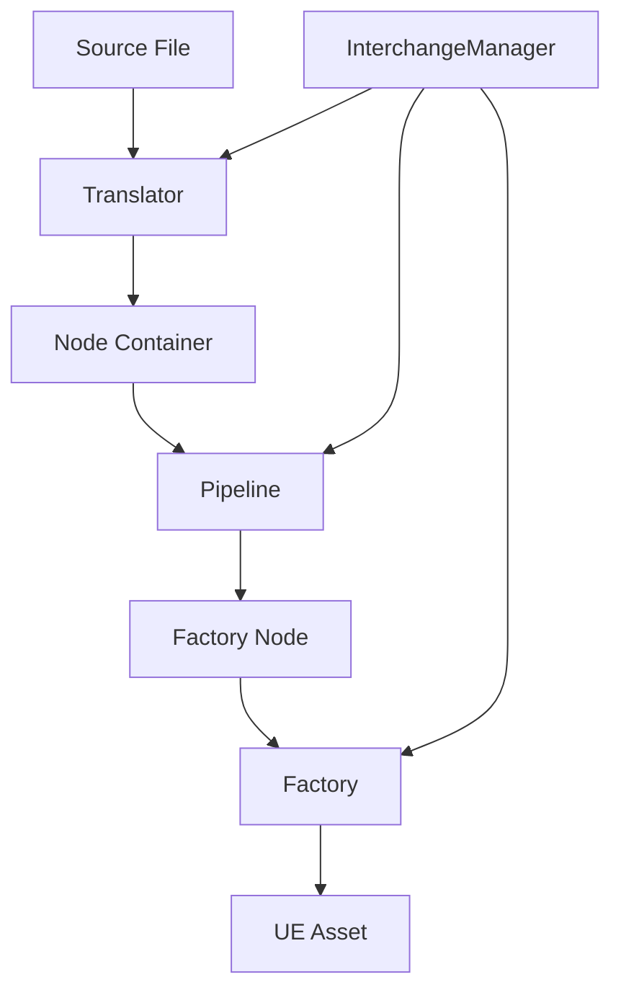

# Unreal Engine 5.5 Interchange 系统架构深度分析

## 1. 系统概述

Unreal Engine 5.5 的 Interchange 系统是一个现代化的资产导入/导出框架，旨在替代传统的 FBX 导入器和其他格式特定的导入器。该系统采用模块化设计，提供了高度可扩展和可定制的资产处理管道。

## 2. 核心架构组件

### 2.1 主要模块结构

```
InterchangeCustomization/
├── CustomEngine/          # 自定义引擎扩展
├── CustomImport/          # 导入器和翻译器
├── CustomNodes/           # 节点定义
├── CustomFactoryNodes/    # 工厂节点
└── CustomPipelines/       # 管道处理
```

### 2.2 核心组件关系图



## 3. 关键设计模式

### 3.1 翻译器模式 (Translator Pattern)
- **UInterchangeTranslatorBase**: 所有翻译器的基类
- **职责**: 将外部文件格式转换为 Interchange 节点
- **示例**: `UCustomFooTranslator` 处理 .foo 格式文件

### 3.2 节点容器模式 (Node Container Pattern)
- **UInterchangeBaseNodeContainer**: 存储所有翻译后的节点
- **节点类型**:
  - TranslatedAsset: 翻译后的资产节点
  - FactoryData: 工厂数据节点

### 3.3 管道模式 (Pipeline Pattern)
- **UInterchangePipelineBase**: 管道基类
- **职责**: 处理节点数据，创建工厂节点
- **可配置性**: 支持用户自定义导入设置

### 3.4 工厂模式 (Factory Pattern)
- **UInterchangeFactoryBase**: 工厂基类
- **职责**: 根据工厂节点创建实际的 UE 资产

## 4. 数据流架构

### 4.1 导入流程
1. **文件识别**: InterchangeManager 根据文件扩展名选择合适的 Translator
2. **翻译阶段**: Translator 解析文件并创建节点
3. **管道处理**: Pipeline 处理节点并创建 Factory 节点
4. **资产创建**: Factory 根据 Factory 节点创建最终资产

### 4.2 节点生命周期
```cpp
// 1. 节点创建
UCustomDemoObjectNode* Node = NewObject<UCustomDemoObjectNode>(&BaseNodeContainer);
Node->InitializeCustomDemoObjectNode(NodeUID, DisplayLabel);

// 2. 设置载荷键
Node->SetPayLoadKey(Filename);

// 3. 添加到容器
BaseNodeContainer.AddNode(Node);
```

## 5. 模块依赖关系

### 5.1 依赖层次
```
CustomPipelines (最高层)
    ↓
CustomFactoryNodes
    ↓
CustomImport
    ↓
CustomNodes
    ↓
CustomEngine (最底层)
```

### 5.2 核心依赖模块
- **InterchangeCore**: 核心接口和基类
- **InterchangeEngine**: 引擎集成
- **InterchangeNodes**: 标准节点定义
- **InterchangeFactoryNodes**: 标准工厂节点

## 6. 扩展点和自定义机制

### 6.1 自定义翻译器
```cpp
class UCustomFooTranslator : public UInterchangeTranslatorBase, 
                            public ICustomDemoObjectPayloadInterface
{
    virtual TArray<FString> GetSupportedFormats() const override;
    virtual bool Translate(UInterchangeBaseNodeContainer& BaseNodeContainer) const override;
    virtual TOptional<UE::Interchange::FCustomDemoObjectData> GetDemoObjectPayloadData(const FString& PayloadKey) const override;
};
```

### 6.2 自定义节点
```cpp
class UCustomDemoObjectNode : public UInterchangeBaseNode
{
    void InitializeCustomDemoObjectNode(const FString& UniqueID, const FString& DisplayLabel);
    virtual const TOptional<FString> GetPayLoadKey() const;
    virtual void SetPayLoadKey(const FString& PayLoadKey);
};
```

### 6.3 自定义管道
```cpp
class UCustomDemoObjectPipeline : public UInterchangePipelineBase
{
    virtual void ExecutePipeline(UInterchangeBaseNodeContainer* InBaseNodeContainer, 
                                const TArray<UInterchangeSourceData*>& InSourceDatas, 
                                const FString& ContentBasePath) override;
};
```

## 7. 注册机制

### 7.1 组件注册
```cpp
void FCustomImportModule::StartupModule()
{
    UInterchangeManager& InterchangeManager = UInterchangeManager::GetInterchangeManager();
    
    // 注册翻译器
    InterchangeManager.RegisterTranslator(UCustomFooTranslator::StaticClass());
    
    // 注册工厂
    InterchangeManager.RegisterFactory(UCustomDemoObjectFactory::StaticClass());
}
```

## 8. 性能优化特性

### 8.1 异步处理
- **ImportAsset_Async**: 重载荷操作在异步线程执行
- **BeginImportAsset_GameThread**: 轻量级操作在游戏线程执行

### 8.2 载荷延迟加载
- **PayloadKey**: 标识特定的数据载荷
- **PayloadInterface**: 按需获取载荷数据

## 9. 错误处理和日志

### 9.1 结构化错误报告
```cpp
UInterchangeResultError_Generic* Message = AddMessage<UInterchangeResultError_Generic>();
Message->SourceAssetName = Arguments.SourceData->GetFilename();
Message->DestinationAssetName = Arguments.AssetName;
Message->AssetType = GetFactoryClass();
Message->Text = ErrorInfo;
```

### 9.2 专用日志类别
```cpp
DEFINE_LOG_CATEGORY(LogCustomImport);
DEFINE_LOG_CATEGORY(LogCustomPipeline);
```

## 10. 配置和特性标志

### 10.1 控制台变量
```cpp
static bool GInterchangeEnableCustomFooImport = true;
static FAutoConsoleVariableRef CCvarInterchangeEnableCustomFooImport(
    TEXT("Interchange.FeatureFlags.Import.Foo"),
    GInterchangeEnableCustomFooImport,
    TEXT("Whether Foo support is enabled."),
    ECVF_Default);
```

## 11. 架构优势

1. **模块化**: 每个组件职责单一，易于维护和扩展
2. **可扩展性**: 通过接口和基类支持自定义实现
3. **性能**: 异步处理和延迟加载优化性能
4. **类型安全**: 强类型系统减少运行时错误
5. **可配置性**: 丰富的配置选项和用户界面集成

## 12. 与传统导入器的对比

| 特性 | 传统导入器 | Interchange 系统 |
|------|------------|------------------|
| 架构 | 单体式 | 模块化 |
| 扩展性 | 有限 | 高度可扩展 |
| 配置 | 硬编码 | 动态配置 |
| 性能 | 同步处理 | 异步处理 |
| 错误处理 | 基础 | 结构化 |
| 重用性 | 低 | 高 |

这个架构分析为后续的 API 分析和开发文档奠定了基础。
