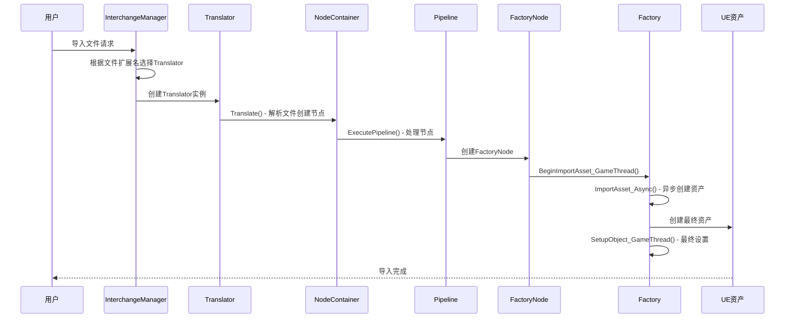

# Unreal Engine 5.5 Interchange 工作流程深度分析

## 1. 完整导入流程概览

### 1.1 流程时序图


## 2. 阶段一：文件识别与翻译器选择

### 2.1 InterchangeManager 的角色
```cpp
// InterchangeManager 启动导入流程
class UInterchangeManager
{
public:
    // 注册翻译器
    void RegisterTranslator(UClass* TranslatorClass);
    
    // 根据文件选择合适的翻译器
    UInterchangeTranslatorBase* GetTranslatorForSourceData(const UInterchangeSourceData* SourceData);
    
    // 执行导入流程
    void ImportAsset(const FImportAssetParameters& ImportAssetParameters);
};
```

### 2.2 翻译器选择逻辑
```cpp
// 在模块启动时注册翻译器
void FCustomImportModule::StartupModule()
{
    auto RegisterItems = []()
    {
        UInterchangeManager& InterchangeManager = UInterchangeManager::GetInterchangeManager();
        
        // 注册自定义翻译器
        InterchangeManager.RegisterTranslator(UCustomFooTranslator::StaticClass());
        InterchangeManager.RegisterFactory(UCustomDemoObjectFactory::StaticClass());
    };
    
    if (GEngine)
    {
        RegisterItems();
    }
    else
    {
        FCoreDelegates::OnPostEngineInit.AddLambda(RegisterItems);
    }
}
```

## 3. 阶段二：文件翻译与节点创建

### 3.1 翻译器工作流程
```cpp
bool UCustomFooTranslator::Translate(UInterchangeBaseNodeContainer& BaseNodeContainer) const
{
    // 1. 验证源文件
    FString Filename = SourceData->GetFilename();
    FPaths::NormalizeFilename(Filename);
    if (!FPaths::FileExists(Filename))
    {
        return false;
    }
    
    // 2. 创建节点
    FString DisplayLabel = FPaths::GetBaseFilename(Filename);
    FString NodeUID(Filename);
    UCustomDemoObjectNode* CustomDemoObjectNode = NewObject<UCustomDemoObjectNode>(&BaseNodeContainer);
    
    // 3. 初始化节点
    CustomDemoObjectNode->InitializeCustomDemoObjectNode(NodeUID, DisplayLabel);
    CustomDemoObjectNode->SetPayLoadKey(Filename);
    
    // 4. 添加到容器
    BaseNodeContainer.AddNode(CustomDemoObjectNode);
    
    return true;
}
```

### 3.2 节点创建详细流程
```cpp
// 节点初始化过程
void UCustomDemoObjectNode::InitializeCustomDemoObjectNode(const FString& UniqueID, const FString& DisplayLabel)
{
    // 调用基类初始化
    InitializeNode(UniqueID, DisplayLabel, EInterchangeNodeContainerType::TranslatedAsset);
}

// 设置载荷键
void UCustomDemoObjectNode::SetPayLoadKey(const FString& PayLoadKey)
{
    // 使用属性系统存储载荷键
    SetAttribute<FString>(UE::Interchange::FCustomDemoObjectNodeStaticData::PayLoadKey(), PayLoadKey);
}
```

## 4. 阶段三：管道处理与工厂节点创建

### 4.1 管道执行流程
```cpp
void UCustomDemoObjectPipeline::ExecutePipeline(UInterchangeBaseNodeContainer* InBaseNodeContainer, 
                                               const TArray<UInterchangeSourceData*>& InSourceDatas, 
                                               const FString& ContentBasePath)
{
    // 1. 验证输入
    if (!InBaseNodeContainer)
    {
        UE_LOG(LogCustomPipeline, Warning, TEXT("Cannot execute pipeline: BaseNodeContainer is null"));
        return;
    }
    
    // 2. 存储引用
    BaseNodeContainer = InBaseNodeContainer;
    SourceDatas.Empty(InSourceDatas.Num());
    for (const UInterchangeSourceData* SourceData : InSourceDatas)
    {
        SourceDatas.Add(SourceData);
    }
    
    // 3. 查找相关节点
    BaseNodeContainer->IterateNodes([this](const FString& NodeUid, UInterchangeBaseNode* Node)
    {
        switch(Node->GetNodeContainerType())
        {
            case EInterchangeNodeContainerType::TranslatedAsset:
            {
                if (UCustomDemoObjectNode* CustomDemoObjectNode = Cast<UCustomDemoObjectNode>(Node))
                {
                    CustomDemoObjectNodes.Add(CustomDemoObjectNode);
                }
            }
            break;
        }
    });
    
    // 4. 创建工厂节点
    if (bImportDemoObjects)
    {
        for (UCustomDemoObjectNode* CustomDemoObjectNode : CustomDemoObjectNodes)
        {
            CreateDemoObjectFactoryNode(CustomDemoObjectNode);
        }
    }
}
```

### 4.2 工厂节点创建详细过程
```cpp
UCustomDemoObjectFactoryNode* UCustomDemoObjectPipeline::CreateDemoObjectFactoryNode(const UCustomDemoObjectNode* CustomDemoObjectNode)
{
    // 1. 生成工厂节点UID
    FString DisplayLabel = CustomDemoObjectNode->GetDisplayLabel();
    FString NodeUid = UInterchangeFactoryBaseNode::BuildFactoryNodeUid(CustomDemoObjectNode->GetUniqueID());
    
    // 2. 检查是否已存在
    UCustomDemoObjectFactoryNode* DemoObjectFactoryNode = nullptr;
    if (BaseNodeContainer->IsNodeUidValid(NodeUid))
    {
        DemoObjectFactoryNode = Cast<UCustomDemoObjectFactoryNode>(BaseNodeContainer->GetFactoryNode(NodeUid));
    }
    else
    {
        // 3. 创建新的工厂节点
        DemoObjectFactoryNode = NewObject<UCustomDemoObjectFactoryNode>(BaseNodeContainer);
        DemoObjectFactoryNode->InitializeNode(NodeUid, DisplayLabel, EInterchangeNodeContainerType::FactoryData);
        
        // 4. 设置载荷键
        TOptional<FString> PayloadKey = CustomDemoObjectNode->GetPayLoadKey();
        if (PayloadKey.IsSet())
        {
            DemoObjectFactoryNode->SetPayLoadKey(PayloadKey.GetValue());
        }
        
        // 5. 应用管道设置
        constexpr bool bAddApplyDelegate = true;
        DemoObjectFactoryNode->SetCustombAssetSettingBoolean(bAssetSettingBoolean, bAddApplyDelegate);
        DemoObjectFactoryNode->SetCustomAssetSettingFloat(AssetSettingFloat, bAddApplyDelegate);
        DemoObjectFactoryNode->SetCustomAssetSettingString(AssetSettingString, bAddApplyDelegate);
        DemoObjectFactoryNode->SetCustomAssetSettingEnum(AssetSettingEnum, bAddApplyDelegate);
        
        // 6. 建立节点关系
        BaseNodeContainer->AddNode(DemoObjectFactoryNode);
        DemoObjectFactoryNode->AddTargetNodeUid(CustomDemoObjectNode->GetUniqueID());
        CustomDemoObjectNode->AddTargetNodeUid(DemoObjectFactoryNode->GetUniqueID());
    }
    
    return DemoObjectFactoryNode;
}
```

## 5. 阶段四：资产工厂处理

### 5.1 工厂三阶段处理模式
```cpp
class UCustomDemoObjectFactory : public UInterchangeFactoryBase
{
public:
    // 阶段1：游戏线程预处理
    virtual FImportAssetResult BeginImportAsset_GameThread(const FImportAssetObjectParams& Arguments) override;
    
    // 阶段2：异步线程重载荷处理
    virtual FImportAssetResult ImportAsset_Async(const FImportAssetObjectParams& Arguments) override;
    
    // 阶段3：游戏线程最终设置
    virtual void SetupObject_GameThread(const FSetupObjectParams& Arguments) override;
};
```

### 5.2 BeginImportAsset_GameThread 详细流程
```cpp
FImportAssetResult UCustomDemoObjectFactory::BeginImportAsset_GameThread(const FImportAssetObjectParams& Arguments)
{
    FImportAssetResult ImportAssetResult;
    
    // 1. 获取工厂节点
    UCustomDemoObjectFactoryNode* DemoObjectFactoryNode = Cast<UCustomDemoObjectFactoryNode>(Arguments.FactoryNode);
    if (!DemoObjectFactoryNode)
    {
        return ImportAssetResult;
    }
    
    // 2. 创建或获取现有资产
    UDemoObject* DemoObjectAsset = nullptr;
    UObject* ExistingAsset = Arguments.ReplacedAsset;
    
    if (!ExistingAsset)
    {
        // 创建新资产
        DemoObjectAsset = NewObject<UDemoObject>(Arguments.Parent, Arguments.AssetClass, *Arguments.AssetName, RF_Public | RF_Standalone);
    }
    else
    {
        // 使用现有资产（重导入场景）
        DemoObjectAsset = Cast<UDemoObject>(ExistingAsset);
        if (!bIsReimport && Arguments.Translator->GetSupportedAssetTypes() != EInterchangeTranslatorAssetType::Textures)
        {
            ImportAssetResult.bIsFactorySkipAsset = true;
            bSkipImport = true;
        }
    }
    
    ImportAssetResult.ImportedObject = DemoObjectAsset;
    return ImportAssetResult;
}
```

### 5.3 ImportAsset_Async 载荷处理
```cpp
FImportAssetResult UCustomDemoObjectFactory::ImportAsset_Async(const FImportAssetObjectParams& Arguments)
{
    FImportAssetResult ImportAssetResult;
    ImportAssetResult.bIsFactorySkipAsset = bSkipImport;
    
    if (bSkipImport)
    {
        return ImportAssetResult;
    }
    
    // 1. 获取载荷接口
    const ICustomDemoObjectPayloadInterface* CustomDemoObjectPayloadInterface = Cast<ICustomDemoObjectPayloadInterface>(Arguments.Translator);
    if (!CustomDemoObjectPayloadInterface)
    {
        UE_LOG(LogCustomImport, Error, TEXT("Translator does not implement ICustomDemoObjectPayloadInterface"));
        return ImportAssetResult;
    }
    
    // 2. 获取载荷键
    UCustomDemoObjectFactoryNode* DemoObjectFactoryNode = Cast<UCustomDemoObjectFactoryNode>(Arguments.FactoryNode);
    const TOptional<FString>& PayLoadKey = DemoObjectFactoryNode->GetPayLoadKey();
    if (!PayLoadKey.IsSet())
    {
        UE_LOG(LogCustomImport, Error, TEXT("Invalid payload key"));
        return ImportAssetResult;
    }
    
    // 3. 获取载荷数据
    TOptional<UE::Interchange::FCustomDemoObjectData> PayloadData = CustomDemoObjectPayloadInterface->GetDemoObjectPayloadData(PayLoadKey.GetValue());
    if (!PayloadData.IsSet())
    {
        UE_LOG(LogCustomImport, Error, TEXT("Failed to get payload data"));
        return ImportAssetResult;
    }
    
    // 4. 处理载荷数据
    UDemoObject* DemoObjectAsset = Cast<UDemoObject>(Arguments.ImportedObject);
    if (DemoObjectAsset)
    {
        DemoObjectAsset->SourceData = PayloadData->FormatJsonData;
    }
    
    return ImportAssetResult;
}
```

### 5.4 SetupObject_GameThread 最终设置
```cpp
void UCustomDemoObjectFactory::SetupObject_GameThread(const FSetupObjectParams& Arguments)
{
    UDemoObject* DemoObjectAsset = Cast<UDemoObject>(Arguments.ImportedObject);
    if (!DemoObjectAsset)
    {
        return;
    }
    
#if WITH_EDITOR
    UInterchangeFactoryBaseNode* DemoObjectFactoryNode = Arguments.FactoryNode;
    if (!Arguments.bIsReimport)
    {
        // 应用所有自定义属性到资产
        DemoObjectFactoryNode->ApplyAllCustomAttributeToObject(DemoObjectAsset);
    }
    else
    {
        // 重导入策略处理
        UInterchangeAssetImportData* InterchangeAssetImportData = Cast<UInterchangeAssetImportData>(DemoObjectAsset->AssetImportData);
        UInterchangeFactoryBaseNode* PreviousNode = nullptr;
        if (InterchangeAssetImportData)
        {
            PreviousNode = InterchangeAssetImportData->GetStoredFactoryNode(InterchangeAssetImportData->NodeUniqueID);
        }
        
        UInterchangeFactoryBaseNode* CurrentNode = NewObject<UInterchangeFactoryBaseNode>(GetTransientPackage(), UCustomDemoObjectFactoryNode::StaticClass());
        UInterchangeBaseNode::CopyStorage(DemoObjectFactoryNode, CurrentNode);
        CurrentNode->FillAllCustomAttributeFromObject(DemoObjectAsset);
        
        // 应用重导入策略
        UE::Interchange::FFactoryCommon::ApplyReimportStrategyToAsset(DemoObjectAsset, PreviousNode, CurrentNode, DemoObjectFactoryNode);
    }
#endif
}
```

## 6. 载荷数据处理机制

### 6.1 载荷接口实现
```cpp
TOptional<UE::Interchange::FCustomDemoObjectData> UCustomFooTranslator::GetDemoObjectPayloadData(const FString& PayloadKey) const
{
    UE::Interchange::FCustomDemoObjectData CustomDemoObjectData;
    
    // 从源文件加载数据
    FFileHelper::LoadFileToString(CustomDemoObjectData.FormatJsonData, *SourceData->GetFilename());
    
    return MoveTemp(CustomDemoObjectData);
}
```

### 6.2 载荷延迟加载优势
1. **性能优化**: 只在需要时加载重载荷数据
2. **内存效率**: 避免在翻译阶段加载大量数据
3. **并发处理**: 载荷获取可以在异步线程执行
4. **错误隔离**: 载荷错误不影响节点创建

## 7. 错误处理与日志记录

### 7.1 结构化错误报告
```cpp
auto ImportDemoObjectErrorLog = [this, &Arguments](const FText& Info)
{
    UInterchangeResultError_Generic* Message = AddMessage<UInterchangeResultError_Generic>();
    Message->SourceAssetName = Arguments.SourceData->GetFilename();
    Message->DestinationAssetName = Arguments.AssetName;
    Message->AssetType = GetFactoryClass();
    Message->Text = Info;
};
```

### 7.2 日志分类
```cpp
DEFINE_LOG_CATEGORY(LogCustomImport);
DEFINE_LOG_CATEGORY(LogCustomPipeline);

// 使用示例
UE_LOG(LogCustomImport, Error, TEXT("Cannot import DemoObject, translator does not implement payload interface"));
UE_LOG(LogCustomPipeline, Warning, TEXT("Cannot execute pipeline: BaseNodeContainer is null"));
```

## 8. 性能优化策略

### 8.1 异步处理分离
- **游戏线程**: 轻量级操作（UI更新、资产注册）
- **异步线程**: 重载荷操作（文件I/O、数据解析）

### 8.2 内存管理
- **节点容器**: 统一管理所有节点的生命周期
- **载荷延迟**: 按需加载，减少内存占用
- **智能指针**: 使用TObjectPtr自动管理对象引用

## 9. 扩展点总结

1. **翻译器扩展**: 支持新文件格式
2. **节点扩展**: 定义新的数据结构
3. **管道扩展**: 自定义处理逻辑
4. **工厂扩展**: 创建新类型资产
5. **载荷接口**: 处理特定数据格式

这个工作流程分析展示了Interchange系统的完整数据流和各组件间的协作机制。
